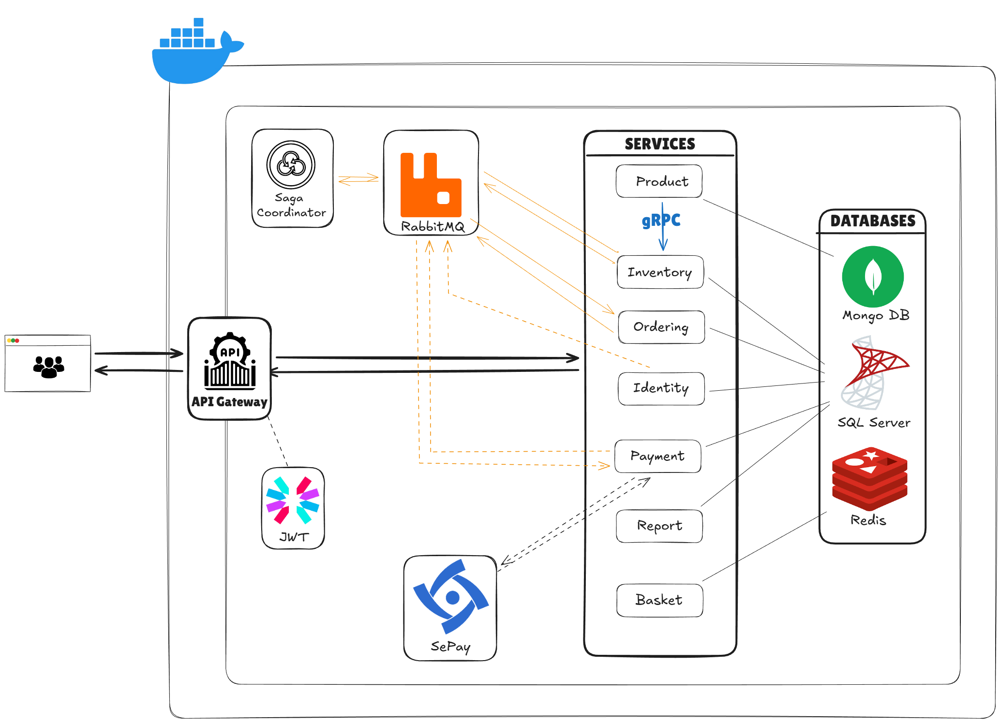

# ECommerce Microservices Platform

### A Distributed E-Commerce Platform with Microservices Architecture

A distributed eCommerce system built with **.NET 8**, **YARP Gateway**, **Saga Orchestration (RabbitMQ)**, **gRPC**, and a **Polyglot Persistence** model — fully simulating the workflow of a modern e-commerce platform.

---
## System Architecture Overview



---

## Project Goals

- Build a complete eCommerce backend platform following **Microservices** architecture.
- Apply **Clean Architecture**, **CQRS**, and **DDD** to optimize scalability and maintainability.
- Implement **Saga Orchestration** with RabbitMQ to manage order workflows with rollback support.
- Integrate **YARP API Gateway** for centralized routing, authentication, and security.
- Use **gRPC** to reduce latency in internal service-to-service communication.
- Apply **Polyglot Persistence** (SQL Server, MongoDB, Redis) tailored to each data problem.
- Improve overall system stability and performance.
- Containerize the entire system using **Docker Compose**.
- Fully simulate the eCommerce flow: login, shopping cart, inventory check, payment, and order confirmation.
- Strengthen skills in distributed system design, workflow management, API security, and real-time event handling.

---

## Tech Stack

### Backend & Framework
- .NET 8 – ASP.NET Core Web API
- Clean Architecture, DDD (Domain-Driven Design)
- CQRS + MediatR
- FluentValidation

### Service Communication
- **YARP API Gateway** – centralized routing & security
- **gRPC** – high-speed internal communication
- **RabbitMQ** – Event Bus & Saga Orchestration

### Authentication & Security
- JWT Authentication
- RBAC (Role-Based Access Control)
- Idempotency Handling (especially for the payment module)

### Databases (Polyglot Persistence)
- **SQL Server** – Transactional data (Orders, Users, Inventory)
- **MongoDB** – Product catalog data
- **Redis** – Caching & shopping cart

### Payments
- Sepay Payment Webhook – real-time payment processing

### Containerization
- Docker & Docker Compose

---


<!--
## Port Mapping

| Service / Component       | Port      |
|---------------------------|-----------|
| API Gateway (YARP)        | **8000**  |
| UserService               | **8001**  |
| ProductService            | **8002**  |
| OrderService              | **8003**  |
| InventoryService          | **8004**  |
| BasketService             | **8005**  |
| PaymentService            | **8006**  |
| Saga Orchestrator         | internal  |
| SQL Server                | **1433**  |
| MongoDB                   | **27017** |
| Redis                     | **6379**  |
| RabbitMQ (AMQP)           | **5672**  |
| RabbitMQ Management UI    | **15672** |

---

## Getting Started

### 1. Clone the repository
```bash
git clone https://github.com/mahaidang/ecommerce.git
cd ecommerce
```

### 2. Run the system with Docker Compose
```bash
docker-compose up -d
```
-->
